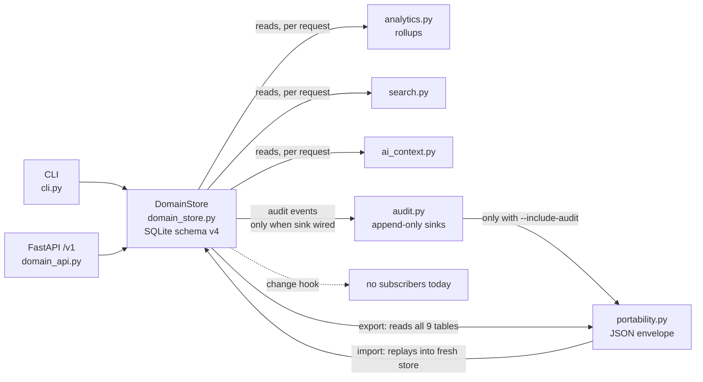

# Innerwork — Architecture Overview

> **Status:** living document for new contributors. Every module name and
> command below was checked against `src/innerwork/` at the time of writing;
> where a relationship is **not** wired in code, this document says so
> explicitly. This is an overview of the **work-graph / knowledge-graph
> domain** (the `/v1/` product surface). The legacy edge-broker PoC
> (`broker.py`, `control_plane.py`, `model.py`, the `/v2/` API) is out of
> scope here and is only mentioned to say so.

## 1. The six subsystems at a glance

| Subsystem | Module(s) | Role |
|-----------|-----------|------|
| Catalog (domain collections) | `domain.py`, `knowledge.py`, `comments.py` | Pure frozen dataclasses: projects, work items, transitions, spaces, pages, page versions, links, comments |
| Workflow | `domain.py`, enforced in `domain_store.py` | State machine (`todo → in_progress → done`), guarded transitions, append-only transition history |
| Domain store | `domain_store.py` | Single-writer SQLite persistence layer (`DomainStore`), schema v4, additive migrations |
| Analytics | `analytics.py` | Deterministic read-only rollups (point-in-time + time-windowed), permission-filtered |
| Audit | `audit.py` | Optional append-only audit event pipeline; sink is a no-op until wired |
| Portability | `portability.py` | Deterministic JSON export/import, `format_version` 1 / 2, streaming export |

There is no central "engine". The subsystems are layered: **dataclasses →
`DomainStore` → read-side consumers** (search / analytics / ai_context) and
**`DomainStore` → portability**, with **audit** as an opt-in side channel
from write paths into sinks.

## 2. Subsystem map



Same picture in ASCII (terminal-friendly):

```
  CLI (cli.py)                    FastAPI /v1 (domain_api.py)
    |  mutating commands            |  CRUD / search / ai_context / metrics
    v                               v
  +---------------------------------------------------------------+
  |  DomainStore (domain_store.py)  — one SQLite file              |
  |  tables: projects, project_sequences, work_items,              |
  |          work_item_transitions, spaces, pages, page_versions,  |
  |          work_item_page_links, work_item_comments,             |
  |          page_comments, v1_idempotency_keys, meta              |
  +-------+----------------------------------------+--------------+
          |  _audit() (no-op until sink wired)      |  read-only queries
          v                                        v
  +----------------------+        +----------------------------------+
  |  audit.py sinks      |        |  analytics.py  (rollups)          |
  |  append-only rows    |        |  search.py     (search_domain)    |
  |  (Sqlite/Jsonl/Mem)  |        |  ai_context.py (context bundles)  |
  +----------+-----------+        +----------------------------------+
             |
             |  --include-audit → format_version 2
             v
  +---------------------------------------------------------------+
  |  portability.py — export_domain(_json/_json_stream),          |
  |  import_domain(_json); deterministic envelope, byte-stable    |
  +---------------------------------------------------------------+
```

## 3. Catalog — the domain collections

The roadmap's "catalog" is the set of persisted domain collections. The
objects themselves are **pure frozen dataclasses** with validation in
`__post_init__` and a `to_dict()` serializer; they contain no persistence
logic:

- **Work graph** — `domain.py`: `Project` (uppercase `key`, `visibility`,
  `members`), `WorkItem` (project-scoped `key` like `ENG-1`, `state`,
  `assignee`), `Transition` (append-only state-change record), and
  `WorkflowDefinition` (introspection snapshot).
- **Knowledge graph** — `knowledge.py`: `Space` (uppercase `key`,
  `visibility`, `members`), `Page` (mutable header pointing at
  `current_version`), `PageVersion` (immutable `(title, body, author)`
  snapshot, monotonic `version_number`), `Link` (typed WorkItem ↔ Page edge,
  closed `LINK_KINDS` vocabulary: `documents`, `references`, `implements`,
  `blocks`).
- **Comments** — `comments.py`: `WorkItemComment`, `PageComment`.

> **Naming collision:** `src/innerwork/catalog.py` is **not** the domain
> catalog. It is the edge-broker product catalog (`broker_catalog()`,
> `product_catalog()` reading `data/product_catalog.json`), a leftover of the
> `/v2/` PoC. Domain collections live in `domain.py` / `knowledge.py` /
> `comments.py` and are persisted exclusively through `DomainStore`.

## 4. Workflow

The workflow is a fixed, closed state machine defined as module constants in
`domain.py`:

- States: `WORKFLOW_STATES = ("todo", "in_progress", "done")`; initial state
  `todo`.
- Edges: `ALLOWED_TRANSITIONS` — `todo→in_progress`, `in_progress→done`,
  `in_progress→todo` (reopen), `done→in_progress` (reopen). Reopen edges are
  explicit so the rule set stays auditable.
- `assert_transition_allowed()` raises `InvalidTransitionError` on unknown
  states, no-op transitions, and disallowed edges; `allowed_next_states()`
  and `default_workflow()` expose the machine to the API/CLI.

Enforcement lives in `DomainStore.transition_work_item()`
(`domain_store.py:399`): it validates the edge, rewrites the item's `state` +
`updated_at`, appends a `Transition` row to `work_item_transitions`
(append-only history), and emits an audit event
(`surface="jira_workflow"`, `domain_store.py:446`) **if** a sink is wired.

Cycle time is not computed by the workflow itself — it is derived in
analytics from `work_item_transitions` (see §6).

## 5. Domain store

`DomainStore` (`domain_store.py`) is the single persistence seam for the
whole domain. One SQLite file (`--database-url` /
`INNERWORK_DATABASE_URL`), one writer process; a fresh connection is opened
per call.

- **Schema** — `DOMAIN_SCHEMA_VERSION = 4`, stored in the `meta` table.
  Nine domain tables (projects, work_items, work_item_transitions, spaces,
  pages, page_versions, work_item_page_links, work_item_comments,
  page_comments) plus `project_sequences` (project-scoped key numbering),
  `v1_idempotency_keys` (API replay cache), and `meta`.
- **Migrations** — additive only, via `_ensure_column()` (`ALTER TABLE ...
  ADD COLUMN`), used for the Phase 6 `visibility`/`members` columns. Schema
  version bumps are recorded in `meta`; `innerwork doctor` validates the
  store against drift and operator misconfigurations (read-only).
- **Change hook** — `set_change_hook()` installs a
  `hook(entity, action, identifier)` callback. Today only
  `("project", "created")` and `("space", "created")` emit, and **no
  subscriber exists**: `search.py` and `analytics.py` query the store
  directly on every request rather than maintaining an invalidation-driven
  cache. The hook is a forward-compatible extension point, not a bus.
- **Audit seam** — `DomainStore._audit()` is a no-op until
  `store.audit_sink` is assigned (see §7).

## 6. Analytics

`analytics.py` is a read-only aggregation layer over `DomainStore`. Two
modes, both deterministic (no clocks, no random ids, stable ordering by
project/space key so JSON snapshots are diff-friendly):

- **Point-in-time** — `project_rollup` (work-item count,
  `work_items_by_state`, comment/transition counts), `space_rollup`
  (page/version/comment counts), `domain_rollup` (whole-domain totals
  grouping the per-project/per-space rollups).
- **Time-windowed** — `windowed_domain_rollup` over half-open
  `[start, end)` UTC windows, surfaced by `innerwork metrics
  --window-start/--window-end`. Output keys map to the roadmap's rollup
  concepts:

  | Roadmap concept | Code output | Source data |
  |---|---|---|
  | project_state_counts | `state_counts` | transitions into each state over the window |
  | cycle_time_per_project | `cycle_time_per_project` (`ProjectCycleTime`) | `done`-transition time minus `work_items.created_at` |
  | space_edit_recency | `page_writes` (`PageWritesRollup`) | `page_versions` activity over the window (versions/pages-touched/by-space) |
  | space_contributor_counts | `contributors` (`ContributorsRollup`) | distinct actors across transitions, page versions, comments |

  "Recency" here means **activity-over-window counts**, not a recency score.
  Window bounds must carry an explicit UTC offset; unparseable stored
  timestamps raise `AnalyticsError` loudly rather than silently undercounting.

- **Permission filtering** — when a `Principal` is passed, `can_read()`
  (public → all, internal → any non-anonymous principal, restricted →
  member/group match) gates projects/spaces before counting; `None` means
  the full domain (CLI/internal back-compat).

## 7. Audit

`audit.py` is an optional, synchronous, append-only event pipeline. It is a
**side channel**: writes succeed identically whether or not a sink is wired.

- **Events** — `AuditEvent` (`event_id`, `ts`, `actor`, `actor_kind` ∈
  {system, user, service}, `surface`, `entity_kind`, `entity_id`, `action`,
  `before`/`after`/`metadata`), built by `make_event()`. `surface` is a
  closed enum (`AUDIT_SURFACES`): `jira_workflow`, `confluence_page`,
  `mention`, `permission_change`, `portability_export`, `portability_import`.
- **Sinks** — `AuditSink` protocol with `record()` / `query()`.
  `SqliteAuditSink` (default; own connection per record, append-only SQL
  triggers `RAISE(ABORT)` on UPDATE/DELETE), `JsonlAuditSink` (backup export
  surface), `MemoryAuditSink` (tests). No vendor SIEM integration ships.
- **Wiring** — `store.audit_sink = SqliteAuditSink(path)` after store
  construction; the CLI does this for every command via `--audit-log` /
  `INNERWORK_AUDIT_DB` (`_wire_audit_sink`, `cli.py:442`).
- **What emits today** — `transition_work_item` (`jira_workflow`),
  `create_page` / `update_page` (`confluence_page`), `Notifier.dispatch`
  mention delivery (`mention`), and portability export/import
  (`portability_export` / `portability_import`, recorded only after a
  successful envelope write/import). The `permission_change` surface is
  reserved but **not wired** — `permissions.grant`/`revoke` helpers do not
  exist.
- **Guards** — read events are deliberately **not** audited (cost/noise
  tradeoff). The SQL triggers are documented as a *soft guard*, not a
  security boundary: a host operator can drop them. Forensic-grade
  non-repudiation requires an external WORM store.

## 8. Portability

`portability.py` is a thin, pure shim over `DomainStore`: `export_domain`
snapshots every persisted domain row into a deterministic dict, and
`import_domain` replays a snapshot into a **fresh, empty** store. The
round-trip preserves auto-assigned ids (`transition_id`, `version_id`,
project sequences) so a re-export produces byte-identical JSON.

- **Envelope** — `format_version` + `schema_version` (`DOMAIN_SCHEMA_VERSION`)
  header, then the nine collections in `_COLLECTION_ORDER` (FK-safe,
  parents-first; load-bearing for both byte-stability and import ordering):
  `projects`, `work_items`, `transitions`, `spaces`, `pages`,
  `page_versions`, `links`, `work_item_comments`, `page_comments`.
- **Format versions** — `PORTABILITY_FORMAT_VERSION = 1` (default);
  `PORTABILITY_FORMAT_VERSION_AUDIT = 2`, emitted **only** when
  `--include-audit` is passed (or `include_audit=True` at the API level).
  Default exports stay version 1 and round-trip byte-identical to pre-audit
  snapshots. `_validate_envelope` accepts both on import.
- **Audit inclusion** — with `--include-audit`, the wired sink's rows are
  appended as a trailing `audit` collection, each row passed through
  `field_acl.redact_for(actor_kind, "AuditEvent", row)` (`"system"` →
  verbatim; `"user"`/`"service"` mask the `actor` field). A missing sink
  raises `DomainImportError` **before** any bytes are written — an export
  that silently emitted an empty audit collection would be dishonest.
- **Streaming export** — `export_domain_json_stream()` writes the envelope
  incrementally with `fetchmany` batches (`batch_size`, default 500), so
  peak memory is bounded by one batch, not store size. It is byte-identical
  to `json.dumps(export_domain(...))` for the same store/settings — the
  referee gate. `--progress` prints collection names and counts to stderr
  only (never row content). The CLI streams to a temp file for `--out`
  (atomic `os.replace`) and to stdout otherwise.
- **Import contract** — fresh/empty target only (partial overlays would
  silently corrupt FK/sequence state); FK-safe parent-first inserts;
  `project_sequences` rebuilt and `AUTOINCREMENT` bumped for transitions and
  page versions; audit rows from a v2 payload are replayed to the sink
  **after** the domain restore, and the import's own
  `portability_import` event is recorded after that, so an import's event
  never collides with payload rows.
- **Non-portable surface** — `v1_idempotency_keys` and transient state owned
  by other modules (`notify.py`) are explicitly NOT part of the portable
  envelope.

## 9. Where data lives and how it moves

- **Writes** (CLI `cli.py` or FastAPI `/v1` `domain_api.py`) → `DomainStore`
  mutation → SQLite file. The FastAPI layer adds idempotency (mutating
  `/v1/` calls require `X-Idempotency-Key`; hashes are stored in
  `v1_idempotency_keys`) and principal parsing (`X-Innerwork-Principal` —
  identity, not authentication).
- **Audit** → `DomainStore._audit()` → sink (append-only file), **only when
  wired**; nothing is buffered or shipped anywhere (no telemetry, no network
  calls in any audit path).
- **Reads** → search / analytics / ai_context each open the store and query
  per request. There is **no index, no cache, no invalidation loop**: the
  change hook exists but has zero subscribers (see §5). "Writes → store →
  index invalidation → search/analytics" is therefore **not** how this
  codebase works today — the store is the index.
- **Portability round-trip** → export reads the nine tables in collection
  order (streaming for large stores) → envelope; import replays into a fresh
  store. Audit rows join the envelope only under `--include-audit`
  (format_version 2).

## 10. Read-side consumers

- **`search.py`** — `search_domain(query, kinds, limit, principal)` over
  `SEARCHABLE_KINDS = ("work_item", "page", "comment")`; tokenizes, scores
  title/body, snippets, and permission-filters per project/space via
  `can_read`.
- **`ai_context.py`** — `build_ai_context(store, query | anchor, ...)`
  assembles a deterministic `ContextBundle` (token-budgeted, capped item
  count) using the same ranker as search. It is **LLM-agnostic**: no vendor
  LLM is called anywhere in the codebase — the bundle is the deliverable.

## 11. Deferred / not wired (honest inventory)

- **No vendor LLM wired.** `ai_context` produces context bundles only; there
  is no model call, API key, or network path in the module.
- **Per-object ACLs are deferred.** `field_acl.py` is best-effort
  *serialization redaction* (`redact_for` + `PRIVACY_FIELDS` +
  `DEFAULT_POLICY`), used today only for audit rows in portability exports —
  not a kernel-level access control. The runtime read gate is the
  coarse `visibility`/`members` check (`can_read`). Full per-object ACLs are
  roadmap Phase 7 territory.
- **`permission_change` audit surface** is reserved in the enum but not
  wired (`permissions.grant`/`revoke` helpers don't exist).
- **Change hook** has no subscribers; search/analytics read the store
  directly.
- **Audit read events** are not logged (by design).
- **Append-only triggers** are a soft guard, not a security boundary.
- **Import is restore-only**: no merge/overlay; target must be empty.
- **Idempotency cache and notifier state** are outside the portable surface.
- **JsonlAuditSink** is the backup export surface; no vendor SIEM
  integration ships.
- **Edge broker (`/v2/`)**: `broker.py`, `control_plane.py`, `model.py`,
  `catalog.py` are a separate legacy subsystem sharing the same FastAPI app;
  they are not part of the domain architecture described here.
- **No managed hosting, no telemetry, no SaaS tier** — see
  `docs/roadmap.md` "Explicitly out of scope".

## 12. Exercising this document

All of the following are real, runnable commands (verified against
`src/innerwork/cli.py`):

```bash
uv run innerwork project-create --key ENG --name Engineering --owner alice --database-url sqlite:///tmp/demo.db
uv run innerwork work-item-create --project-id <id> --title "Write docs" --database-url sqlite:///tmp/demo.db
uv run innerwork work-item-transition --work-item-id <id> --to-state in_progress --actor alice --database-url sqlite:///tmp/demo.db

# Analytics (point-in-time and windowed)
uv run innerwork metrics --database-url sqlite:///tmp/demo.db
uv run innerwork metrics --window-start 2026-01-01T00:00:00Z --window-end 2026-12-31T23:59:59Z --database-url sqlite:///tmp/demo.db

# Audit + portability round-trip (v1 → v2 envelope)
uv run innerwork export --out /tmp/domain.json --audit-log /tmp/audit.db --database-url sqlite:///tmp/demo.db
uv run innerwork export --out /tmp/domain-audit.json --include-audit --audit-log /tmp/audit.db --database-url sqlite:///tmp/demo.db
uv run innerwork import /tmp/domain-audit.json --audit-log /tmp/audit2.db --database-url sqlite:///tmp/demo-restored.db

# Read-only store validation
uv run innerwork doctor --database-url sqlite:///tmp/demo.db
```

A quick smoke round-trip: `export --include-audit` bumps `format_version` to
2; re-importing into a fresh store and re-exporting yields byte-identical
JSON (the portability tests enforce this as the referee gate).
